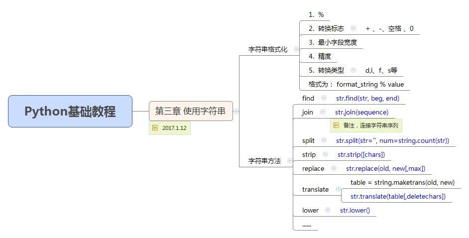

# 使用字符串  
> 请记住： **字符串是不可改变的**，不能进行分片赋值等改变元素的操作  


### 字符串格式化  
* **表示**
```text
使用 % 实现， % 左侧 放置需要格式化的字符串，% 右侧 放置被格式化的值(可以是一个值或者可以使用多个值的元组或字典) 
```
```python
# coding=utf-8
import math
# example 1
format_1 = 'Hello,%s. %s enougth for you!'
values = ('world','Happy') # 多个值的元组
print format_1 % values  # Hello,world.Happy enought for you!
# example 2
format_2 = 'Pi with three decimals: %.3f'
print format_2 % math.pi # 3.142  
```  

* **转换说明符**(注意使用顺序)  

1).  **%** 字符 ：转换说明符开始标志  
2).  转换标志（可选）  
```text
 +: 表示在转换值之前要加上 正负号  
 -：表示 左对齐  
''：表示 正数之前 保留空格  
 0：表示转换值若位数不够则用 0 填充 
```   
3).  最小字段宽度（可选）  
```text
1. 转换后的字符串 至少 应该具有该值指定的宽度；
2. 若是 * ，则宽度值会从 元组 中读出；
```
4).  点(.)后跟精度值（可选）  
```text
1. 若转换的是 实数，精度值表示出现在 小数点后 的位数；
2. 若转换的是 字符串，则表示 最大字段宽度；
3. 若是 * ，则精度值从 元组 中读出；
```
5).  转换类型
```text
d,i  带符号的十进制整数
f,F  十进制浮点数
s    字符串
```
```python
# coding=utf-8
import math
print 'Pi : %f' % math.pi
print 'Pi : %06.2f' % math.pi
print 'Pi : %.3f' % math.pi
print 'Pi : %.*f' % (2, math.pi)
print 'Pi : %10.2f' % math.pi
print 'Pi : %*.*f' % (5, 2, math.pi)
print '%.5s' % 'Hello,World!'
header_format = '%-*s%*s' # 复杂
format_item = '%-*s%*.2f'
```

### 字符串方法  
* **find**  
>**find方法**可以在一个较长的字符串中**查找子串**，返回所在位置的**最左端索引**，若查找失败，返回 **-1**。  
```python
# coding=utf-8
longStr = 'With a moo-moo here, and a moo-moo there'
# 在整个字符串中查找
print longStr.find('moo')  # 7
print longStr.find('mo-moo')  # -1
# 在子串中查找，需要提供起始、结束位置
print longStr.find('moo', 7)  # 7
print longStr.find('moo', 11, 13)  # -1
```
* **join**  
>**join方法**用于连接序列中的元素，需要被连接的元素必须是**字符串**  
```python
# coding=utf-8
seq = ['Hello','World','!']
print ' '.join(seq)
dirs = ['', 'Users', 'lenovo', 'Desktop', 'Python']
print 'C:' + '\\'.join(dirs)
```
* **lower**  
>**lower方法**返回字符串的小写  
```python
# coding=utf-8
print 'WORLD'.lower()
```
* **replace**  
>**replace方法**返回某字符串的所有匹配项均被替换之后所得到的字符串  
```python
# coding=utf-8
raw_string = 'Hello , one world!'
raw_string.replace('one','My')  # raw_string 未更新，生成新的字符串副本
```
* **split**  
>**split方法** 将字符串分割成序列，需提供**分割符**（默认 空格''、换行'\n'等）  
```python
# coding=utf-8
print 'C:\Users\lenovo\Desktop\study'.split('\\')  # 注意转义字符
```
* **strip**  
>**strip方法**返回去除两侧（不包括内部）**空格**(默认)的新字符串  
```python
# coding=utf-8
raw_string = '  Hello,world!  '
print raw_string.strip()
```
* **translate**  
>**translate方法** 只处理**单个字符**的替换，其优势在于可以同时进行多个替换  
```python
# coding=utf-8
from string import maketrans
table = maketrans('cs','kz')  # table 转换表（c->k,s->z替换）
raw_string = 'this is an incredible test.'
print raw_string.translate(table)
```
