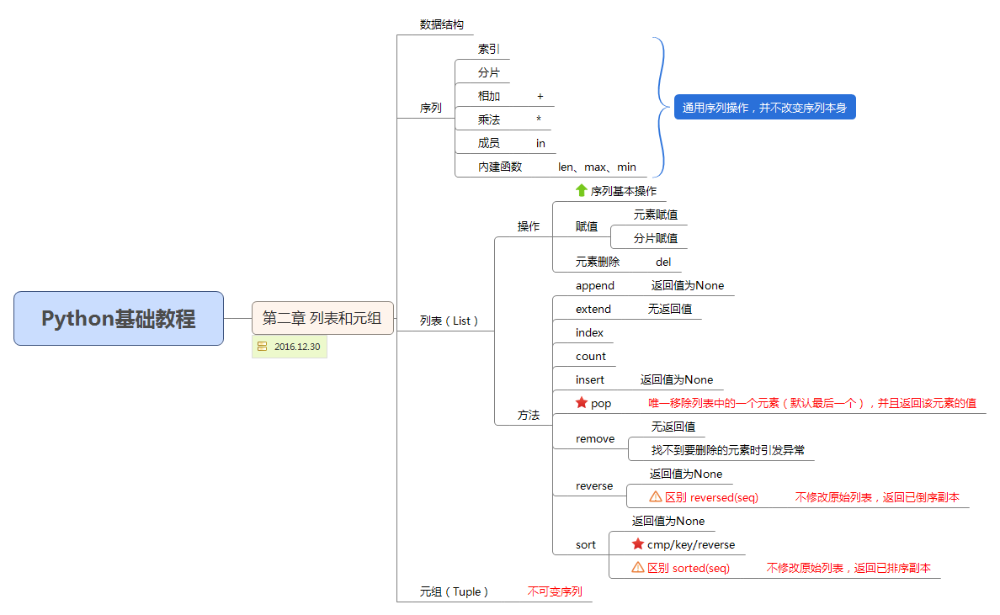

# 列表和元组

> *数据结构*：通过某种方式组织在一起的数据元素的集合。  

* 序列：list(列表)、tuple(元祖)  
* 映射：dict(字典)

###通用序列操作  

1) **索引**  
>**索引：访问单个元素**  

```text
   若从 左->右 访问，则下标从 0 开始；
   若从 右->左 访问，则下标从 -1 开始；
```
例如：
```python
greeting = 'Hello,world!'
print greeting[0] + ',' + greeting[-1]
```
2) **分片**  
>**分片：访问一定范围的元素**  
 
```text
备注：
     1. 分片访问需要提供2个索引，第一个索引的元素是包含在分片内，第二个是不包含在分片内
     2. 若部分提供索引，例如：
        [:5],表示[0,5)
        [:],表示整个序列
        [4:],表示从index=4开始至结束
        [-3:],表示从右数index=-3至结束
     3. 步长，默认步长为1，[start_index:end_index:step]
        step 不能为0
        step 为正数，从 左向右 提取元素，start_index < end_index
        step 为负数，从 右向左 提取元素，start_index > end_index
```
```python
# coding=utf-8
greeting = 'Hello,world!'
print greeting[0:4]  # Hell
print greeting[:]  # Hello,world！
print greeting[:4]  # Hell
print greeting[3:]  # lo,world!
print greeting[-5:-2]  # orl
print greeting[1:1]  # 空
print greeting[2:1]  # 空
print greeting[0:14]  # Hello,world！
print greeting[0:10:3]  # Hlwl
print greeting[-2:-8:-2]  # drw 
print greeting[::-1]
```
3) **相加**  
> 相加：相同类型的序列连接  

```python
# coding=utf-8
print 'Hello' + 'World'
```
4) **乘法**  
> 乘法：序列的重复  

```python
# coding=utf-8
print 'Hello'*5
print [0]*10
```
5) **成员**  
> 成员：`in`运算符，返回值为布尔类型（条件为真返回True，条件为假返回False）  

```python
# coding=utf-8
fruits = ['apple', 'pear', 'banana']
fruit = raw_input('Please input: ')
print fruit + ' is in fruits? ' + str(fruit in fruits)
```
6) **內建函数**  
> len、min、max等


###列表
 
1) **列表操作**  
* 元素赋值  
```text
备注：不能为一个位置不存在的元素进行赋值
```
```python
# coding=utf-8
temp = [1,1,1]
temp[0] = 2
```
* 分片赋值  
```text
备注：
    1. 分片赋值，可以使用与原序列不等长的序列将分片替换；
    2. 通过分片赋值来删除元素；
    3. 在不需要替换任何元素的情况下插入新的元素；
```
```python
# coding=utf-8
name = list('Capricorn')
name[3:7] = list('tern4')  # 分片赋值
print name
name[:3] = []  # 删除
print name
name[1:1] = list('INSERT')  # 插入
print name
```

* 删除元素  
```python
# coding=utf-8
names = ['Alica', 'April', 'Beth', 'Pencil']
del names[0]
print names
```

2) 列表方法  
```text
方法调用： 对象.方法（参数）
```
* append  
```python
# coding=utf-8
# 列表末尾增加某个新的对象，直接对原始列表进行修改
nums = list([1, 2 , 3, 4])
nums.append(5)
print nums
```
* count  
```python
# coding=utf-8
# 统计某个元素在列表中出现的次数
nums = [1, 2, 3, 4, 1]
print nums.count(1)
```
* index  
```python
# coding=utf-8
# 用于从列表中找出某个元素第一个匹配项的索引位置,找不到会引发异常
nums = [1, 2, 3, 4, 1]
print nums.index(1)
```
* extend  
```python
# coding=utf-8
# 在列表末尾追加另外一个序列，直接对被扩展序列修改
nums = [1, 2 , 3, 4]
nums_add = [6, 7, 8]
nums.extend(nums_add)
nums[len(nums):] = nums_add  # 分片赋值实现extend
print nums
```
* insert  
```python
# coding=utf-8
# 将对象插入到列表
nums = [1, 2, 3, 4]
nums.insert(0,5)
nums[1:1] = [6, 7]  # 分片赋值实现insert
print nums
```
* pop  
```python
# coding=utf-8
# pop方法是唯一移除列表中的一个元素（默认最后一个），并且返回该元素的值
x = [1, 2, 3]
element_last = x.pop()  # 默认为最后一个元素
e = x.pop(0)  # 移除第一个元素
x.append(x.pop())
print x  # [2]
```
* remove  
```python
# coding=utf-8
# 用于移除列表中某个值的第一个匹配项,无返回值
x = [1, 2, 3, 4, 1]
x.remove(1)
print x  # [2,3,4,1]
```
* reverse  
```python
# coding=utf-8
# 将列表中的元素反向存放,无返回值
x = [1, 2, 3]
x.reverse()  # 返回值为None,但改变原始列表
print x  # [3,2,1]
y = list(reversed(x))  # 有返回值，不改变原始列表
print x  # [3,2,1]
print y  # [1,2,3]
```
* sort  
```python
# coding=utf-8
# 对原始列表进行排序
x = [4, 3, 5, 2, 1]
x.sort()  # 返回为None，对原始列表已排序，默认升序排列
print x
# 方法1：在不影响原始列表情况，仅需要一个已排序好的副本
y = x[:]  # y = x 是没用的，这样x、y指向同一个列表
y.sort(reverse=True)
print y
# 方法2：使用sorted(),返回已排序的列表副本
y = sorted(x)

```
* 高级排序--待续  
```python
# coding=utf-8
# 高级排序：按照指定的方式进行排序
# sort(cmp,key,reverse)
# cmp: 排序比较函数
# key: 关键字函数，根据key为每个元素创建一个键值，利用键值来排序
# reverse:是否倒序
nums = [5, 2, 9, 7]
nums.sort(cmp)  # cmp为內建函数
print nums
names = ['Apple', 'Pear', 'Banana', 'Durian', 'Peach']
names.sort(cmp)
print names
names.sort(key=len,reverse=True)
print names
```

###元组  
> 元组同列表一样，都是序列，唯一不同是**元组不能修改**  

```python
# coding=utf-8
# 元组的创建
t = (12,)  # 创建一个元素的元组时，逗号是必须的
t = ()
t = (12,23,1)
t = tuple('abc')
t = tuple([1,2,3])
```
###其他
```text
# coding=utf-8
# 本章新函数
cmp(x,y)
len(seq)
list(seq)
tuple(seq)
max(args)
min(args)
reversed(seq)
sorted(seq)
```

