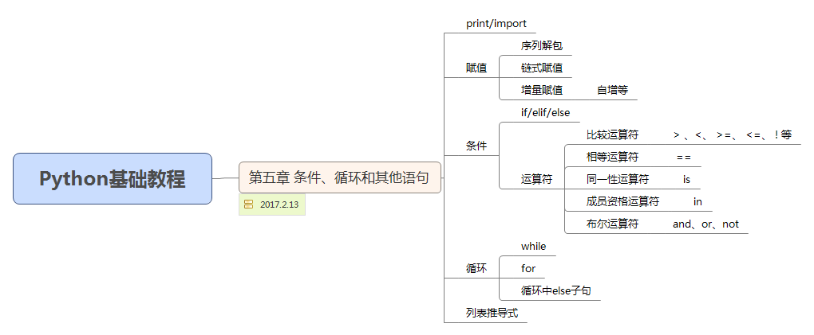

## 条件、循环和其他语句  

### **print 和 import**  
> 1. 使用 **,** 隔开，可同时输出文本与变量值，但是输出结果中会用 **空格** 隔开；
> 2. 在 print 语句结尾处加上 **,** 逗号，那么接下来的语句会与前一条语句在同一行打印；

```python
# coding=utf-8
name = 'Right'
sal = 'Mr.'
greeting = 'Hello,'
print greeting, sal, name                    # Hello, Mr. Right
print greeting, ',', sal, name               # Hello, , Mr. Right
print greeting + ',', sal, name              # Hello,, Mr. Right
print greeting,
print sal                                    # Hello, Mr.
``` 
 
> **import module**  
```text
import module
from module import function  
from module import * 
import module as nickname 
```
 

### **赋值**  
> 1. **序列解包**： 将多个值的序列解开，然后放到变量的序列中  

```python
# coding=utf-8
scoundrel = {'name': 'Bin', 'girlfriend': 'Marion'}
item = scoundrel.popitem()
key, value = item
print key, value
```
> 2. **链式赋值**：将同一个值赋给多个变量   

```python
# coding=utf-8
x = y = 2
```
> 3. **增量赋值**：变量自身进行自增运算  

```python
# coding=utf-8
x = 2
x += 2
print x
```
### **语句块**  
```text
1. 冒号(:) 用来标识语句块的开始；
2. 块中的每行都应该有同样的缩进；
```
### **条件和条件语句**  
> 1.   **布尔值**  

```text
False None 0 '' [] () {} 作为布尔表达式时，被解释为假(false)；其它为真(true)
```
> 2. **if** 语句、**else** 子句、**elif** 子句  

``` python
# coding=utf-8
num = input('Please input a number: ')
if num > 0:
    print '%d is positive' % num
elif num < 0:
    print '%d is negative' % num
else:
    print '%d is zero' % num

# a if b else c  如果b为真，返回a；否则，返回c
```
> 3. **复杂条件--运算符**  

- 比较运算符  
```text
在Python3.0中，不兼容类型的对象无法进行比较
x == y                   # x 等于 y
x < y
x > y
x != y
x <= y
x >= y
x is y                   # x 与 y 是同一对象
x is not y
x in y                   # x 是 y 的成员
x not in y
```
- 相等运算符 **==**  
```python
# coding=utf-8
print 'foo' == 'foo'  # 判断两个对象是否相等，比较值
```
- 同一性运算符 **is**  
```python
# coding=utf-8
# is运算符是判断同一性而不是相等性，is判定两者是否等同，是否为同一个对象
x = y = [1, 2, 3]
z = [1, 2, 3]
print x is y   # true
x = [1, 2, 3]
print x is y   # false
print x is z   # false
print x == y   # true
print x == z   # true
``` 
- 成员资格运算符 **in**  
```python
# coding=utf-8
print 'name' in ['name', 'age']
```
- 字符串和序列比较 
```python
# coding=utf-8
print 'alpha' < 'beta'   # true
print [1, 2] < [2, 1]    # true
``` 
- 布尔运算符  
```text
and  # 连接2个布尔值，并且在两者都为真时返回真，否则返回假
or   # 连接2个布尔值，并且在两者都为假时返回假，否则返回真
not  # 连接1个布尔值，取非
```
- **断言**  

```text
1. 关键字为 assert
2. assert 表达式 errorMessage ： assert 0<-2<10 'it must be realistic.'
```

### 循环  
> 1. **while** 循环  

```python
# coding=utf-8
name = ''
while not name:
    name = raw_input('Please input your name:')
print 'Hello, %s.' % name
```
> 2. **for** 循环  

```python
#coding=utf-8
备注：若能使用for循环，就尽量不用while循环
names = ['Dog', 'Cat', 'Rabbit', 'Ox']
for name in names:
    print name 

d = {'x': 1, 'y': 2, 'z': 3}
for key in d:
    print 'd[%s] = %d' % (key, d[key])

for key, value in d.items():  # 可以在循环中使用序列解包
    print key, ' corresponds to ', value
```  
> 3. 跳出循环  

- **break** 
```text
# 跳出当前循环，继续执行
```
- **contiune**  
```text
# 跳出当前迭代，继续下一轮循环
```
- **while true/break**  
```python
while True:
    word = raw_input('Please enter a word: ')
    if not word:
        break
    print 'The word is :' + word
```
- **循环中else子句**  
```python
# coding=utf-8
# import math
# else子句仅在没有调用break时执行
for num in range(99, 81, -1):
    root = math.sqrt(num)
    if root == int(root):
        print num
        break
else:
    print 'None Found!'
```

### 列表推导式  
> 列表推导式是利用其他列表创建新列表  

```python
# coding=utf-8
print [x*x for x in range(1, 10)]
print [x*x for x in range(1, 10) if x % 3 == 0]
print [(x, y) for x in range(5) for y in range(5)]
```

### 其它  
```text
1. xrange 与 range 函数区别：range函数一次创建整个序列，而xrange函数一次只创建一个数，当需要迭代一个巨大的序列时xrange更高效
2. zip 函数
3. sorted 和 reversed 函数
```